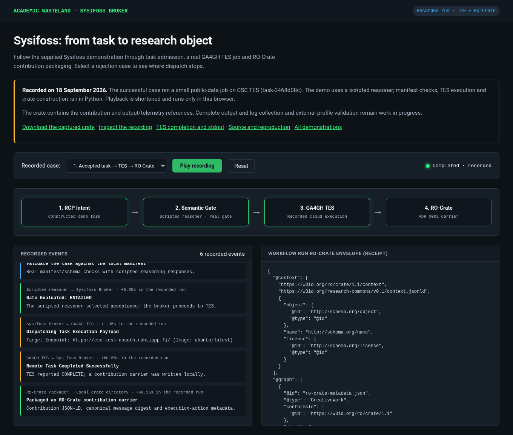

# Reading the demonstrations

These notes accompany the submission and distinguish recorded evidence from new execution. Results and screenshots are taken from the project's captured demonstrations; The original cohort, visitor and variant proofs were reused. The Sysifoss case was additionally rehearsed on 18 September, including one small public-data TES job. The main paper describes the scientific and authorisation methods.

The [observatory](https://leechuck.de/academic-wasteland/) shows relay activity and catalogue descriptions. The [recorded replay](https://leechuck.de/academic-wasteland/replay.html) presents captured runs with inspectable evidence and aggregate downloads. Its signatures and decisions describe historical runs; replay does not renew expired permissions or perform a new analysis.

The [live cohort case](https://leechuck.de/wasteland-live/demo), [live visitor case](https://leechuck.de/wasteland-live/demo/visitor) and [live phenotype case](https://leechuck.de/wasteland-live/demo/phenotypes) depend on the host laptop, its tunnel and configured services remaining available. The visitor case submits remote compute. The replay is the suitable presentation fallback when those services are unavailable.

# Discover a capability through FAIRhaven

Open the [FAIRhaven catalogue](https://leechuck.de/wasteland-fair/) and inspect a phenotype-search service. Identify its publisher, operation, input/output types, constraints, version and reuse conditions. Distinguish the provider's description from metadata validation and any observed checks. The phenotype demonstration retrieves this description and checks that the installed model fingerprint agrees with it before displaying the result.

This use case shows why discovery needs more than a service name: the caller must know what it can send, what result to expect and which version supplied that result. FAIRhaven indexes provider descriptions and records observations; the receiving town makes the access decision. [Implementation and registration instructions](https://github.com/academic-wasteland/wasteland-starter-pack/blob/eeb5f712182ab630db29798dda990290657ef529/docs/fair-services.md) and [bounded auditor design](https://github.com/academic-wasteland/wasteland-starter-pack/blob/eeb5f712182ab630db29798dda990290657ef529/docs/fair-auditor.md) describe the requirements for running the service.

# Demonstration 1: compare cohorts with an aggregate-only grant

**Question.** Can a requester compare two cohorts while the custodian controls the permitted region and released information?

1. Open the cohort case in the replay or live interface and begin the walkthrough.
2. Inspect the initial wait for Ubar's dataset permission. Open the evidence panel to see the task and requested output.
3. In the live demonstration, approve the bounded aggregate request; in replay, advance through the recorded approval.
4. Inspect the signed grant, the two cohort queries and the comparison. Attempt the individual-genotype export to inspect its refusal.

**Captured result.** The stage used two logical sample views of the public JaSaPaGe VCF: nine Saudi samples and ten Japanese samples. Two local workers returned 510 shared callable biallelic sites in GRCh38 chr6:29940000–29950000. The browser rehearsal checked 14 inspectable events, refusal of individual export before computation, and recovery of the result after refresh. This is a local computation with isolated demonstration authorities. The separately documented DDBJ custody-adapter test has its own execution path and grant policy.

{width=95%}

**Reproduction.** Provision the public VCF and stage service as described in the [stage instructions](https://github.com/academic-wasteland/pangenome-town/blob/585b32fc45d741e84290c6d2cb84b659395ecb0c/docs/hackathon-stage.md). From the configured pangenome-town checkout, the following command resets and exercises the local case:

```sh
.venv/bin/python examples/stage_browser_demo.py \
  --screenshot /tmp/wasteland-hackathon-proof.png
```

[Captured browser proof](https://github.com/academic-wasteland/pangenome-town/blob/585b32fc45d741e84290c6d2cb84b659395ecb0c/docs/demos/hackathon-stage.md).

# Demonstration 2: bring data to a permitted compute service

**Question.** Can a visitor use another town's compute while making the data permission and accepted authority explicit?

1. Open the visitor case and retain the supplied synthetic three-site, two-sample VCF.
2. Inspect the visitor's data permission and Yamatai's compute permission. The workflow waits for the isolated Camelot ethics approval before transferring the file or submitting work.
3. Inspect the requested task, input fingerprint and destination, then advance through approval and execution.
4. Inspect the returned aggregate counts and the release checks. In the live interface, execution time includes queueing and the actual DDBJ job.

**Captured result.** Rehearsals completed Slurm jobs 20604587 and 20604631. The browser check verified alternate/called allele counts of 1/4, 3/4 and 1/4. The workflow checks the credential and file binding before transfer and release and removes staged individual-level files. Camelot's approval here is an isolated demonstration credential. It illustrates the mechanism by which an accepted issuer can unlock a bounded task.

{width=95%}

**Reproduction.** The stage instructions describe the DDBJ account, town configurations and remote tools required. With the local stage service and a completed synthetic run available, inspect the existing result without submitting another job:

```sh
.venv/bin/python examples/visitor_browser_demo.py --inspect-existing
```

Omitting `--inspect-existing` exercises submission again and consumes configured remote compute. [Captured browser proof](https://github.com/academic-wasteland/pangenome-town/blob/585b32fc45d741e84290c6d2cb84b659395ecb0c/docs/demos/visitor-stage.md).

# Demonstration 3: phenotype ranking and local variant analysis

**Question.** Can a town use specialist phenotype ranking while keeping the complete variant file within its local analysis step?

The public phenotype interface demonstrates the first part of this workflow. Select the Marfan example or enter ectopia lentis, arachnodactyly and aortic root aneurysm. Run the query, inspect the FAIRhaven description and returned gene ranks, and check the installed-model fingerprint. This sends an actual registered-town request from Yamatai to Ubar. The documented checkpoint ranks FBN1 third among 1,529 mouse gene profiles; the top results include human orthologue annotations. These scores are research rankings, not disease probabilities.

The full variant demonstration additionally filters a local synthetic six-call VCF, combines the phenotype ranks with REVEL and requests interpretation of the selected allele from Themis. Four calls pass. The combined heuristic ranks the selected FBN1 allele first, compared with second by REVEL alone. Only the selected allele and phenotype identifiers are sent for interpretation. The returned PDF reproduces a pinned public expert assessment for that allele and is checked against its digest. The constructed example illustrates workflow behaviour; it does not estimate diagnostic accuracy.

**Reproduction.** The [variant instructions](https://github.com/academic-wasteland/pangenome-town/blob/953b21cc52d43cd0cce9daac53e89cdd81305986/docs/private-variant-demo.md) specify the fixture, model and service dependencies. With the configured towns and bridges running:

```sh
.venv/bin/python examples/private_variant_check.py \
  --pdf /tmp/themis-proof.pdf
```

[Captured full-workflow proof](https://github.com/academic-wasteland/pangenome-town/blob/953b21cc52d43cd0cce9daac53e89cdd81305986/docs/private-variant-proof.md). The web phenotype case and full variant script have different endpoints and outputs; the web query alone does not perform all variant steps.

# Demonstration 4: Sysifoss executes a task and returns an RO-Crate

**Question.** Can a compute broker translate a research task into a standard execution request and preserve the resulting contribution in an inspectable carrier?

Open the [Sysifoss replay](https://leechuck.de/academic-wasteland/sysifoss/) from the main website. Select the accepted task, unknown task or mismatched contract, then choose **Play recording**. Inspect the admission stage, TES dispatch and returned JSON-LD. Reset affects only this browser. The page offers the original crate ZIP, the recorded state transitions and the captured TES response including stdout.

**Captured result.** On 18 September 2026, the supplied stage completed real CSC TES task `task-3468d08c` with exit code zero. It used `ubuntu:latest` to read three lines from the public GA4GH TES README. The negative scenarios returned `unknown` and `invalid` and stopped before dispatch. The stage injects a scripted reasoner; manifest/schema validation, TES execution and carrier construction use the actual Python implementations. The crate preserves the contribution message and execution-action metadata with output/telemetry references. Its current telemetry digest is a placeholder, and the broker does not collect the referenced output or log files into this crate. The separate captured TES response provides the execution evidence for this rehearsal.

{width=95%}

**Dependencies and reproduction.** [Sysifoss](https://github.com/academic-wasteland/sysifoss) uses the RO-Crate builder from [Research Commons PR 3](https://github.com/academic-wasteland/research-commons/pull/3), pinned in the manuscript bibliography. The [public-replay guide](https://github.com/academic-wasteland/sysifoss/blob/main/docs/demos/public-replay.md) describes the source snapshots, captured files and live-stage prerequisites. From Sysifoss, export the existing recording without launching a job:

```sh
python3 docs/demos/export_public_demo.py --output /tmp/sysifoss-public
python3 -m http.server 8399 --bind 127.0.0.1 --directory /tmp/sysifoss-public
```

Open `http://127.0.0.1:8399/`. Re-running the original accepted stage case submits a real TES job. The scripted reasoner tests admission control flow; independent reasoning, external profile validation and complete multi-town provenance require further evaluation. The current image tag and input URL are mutable, so the capture is a record of the observed run rather than a fully pinned environment.

# Inspect issuer choice, delegation and revocation

The certification scenarios provide small local examples of why Camelot is an optional trusted issuer. Different receivers can accept their own issuer, a shared independent board or different authorities for different claims. Later scenarios exercise constrained accreditation, holder impersonation, human delegation, unavailable status, expiry and revocation. Run scenarios individually from a configured checkout:

```sh
.venv/bin/python examples/certification_scenarios.py 1
```

Replace `1` with each number through `6`. The [captured certification report](https://github.com/academic-wasteland/pangenome-town/blob/585b32fc45d741e84290c6d2cb84b659395ecb0c/docs/demos/certification.md) includes commands, expected accept/reject outcomes and a separate isolated Keycloak rehearsal. Its Docker-based example requires the documented container setup. These tests use toy inputs and test authorities.

# Evidence and limitations

Screenshots are reproduced unchanged from the pangenome-town demonstration records at commit `585b32fc45d741e84290c6d2cb84b659395ecb0c`, dated 16 September 2026. The manuscript cites pinned source versions for the other components. A local replay check is available as `examples/public_replay_demo.py`; it examines the published recording without launching computation.

The demonstrations establish specific executed paths and refusals. They do not establish independent institutional federation, universal credential interoperability, clinical utility or benchmark superiority. Complete run packaging, independent replication, broader biological evaluation and comparison with manual or scripted integration are the proposed next tests.
